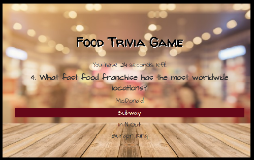
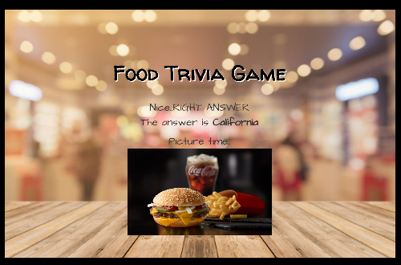
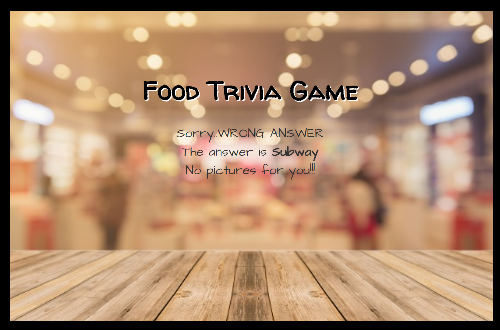

# TriviaGame

### Overview

This simple Trivia game application allows users to answer questions given and display the score afterwards.

### Instructions
The trivia game shows only one question until the player answers it or their time runs out.

* If the player selects the correct answer, show a screen congratulating them for choosing the right option. After a few seconds, display the next question -- do this without user input.

* The scenario is similar for wrong answers and time-outs.

  * If the player runs out of time, tell the player that time's up and display the correct answer. Wait a few seconds, then show the next question.
  * If the player chooses the wrong answer, tell the player they selected the wrong option and then display the correct answer. Wait a few seconds, then show the next question.

* On the final screen, show the number of correct answers, incorrect answers, and an option to restart the game (without reloading the page).

### **[Demo](https://munmuney.github.io/TriviaGame/)**